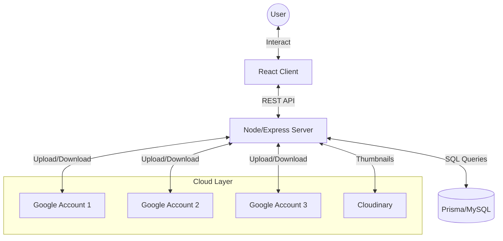
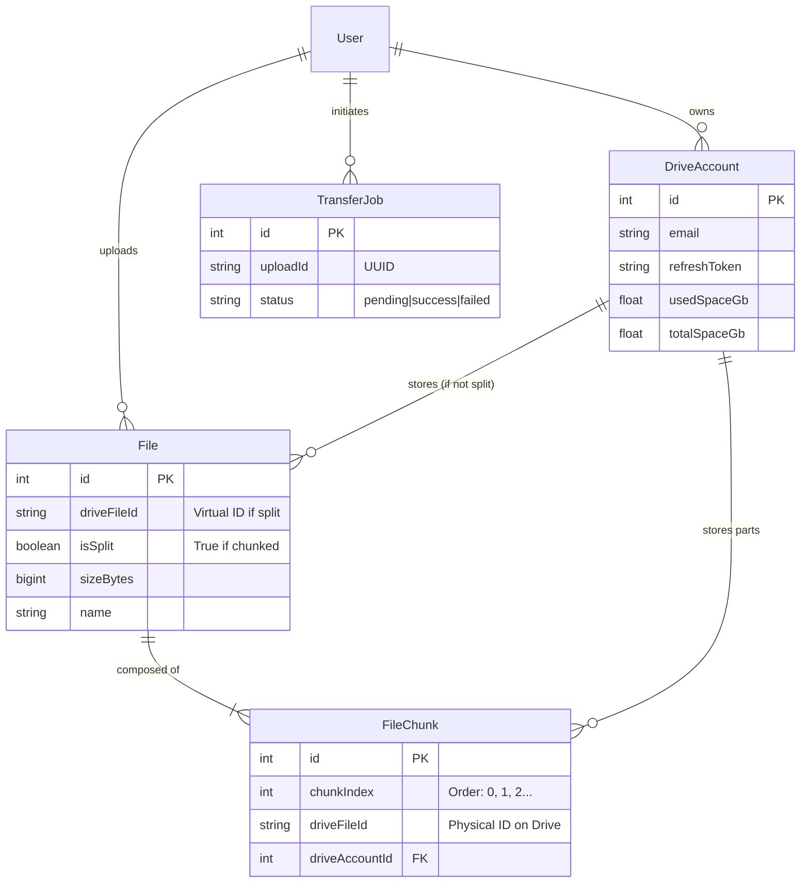
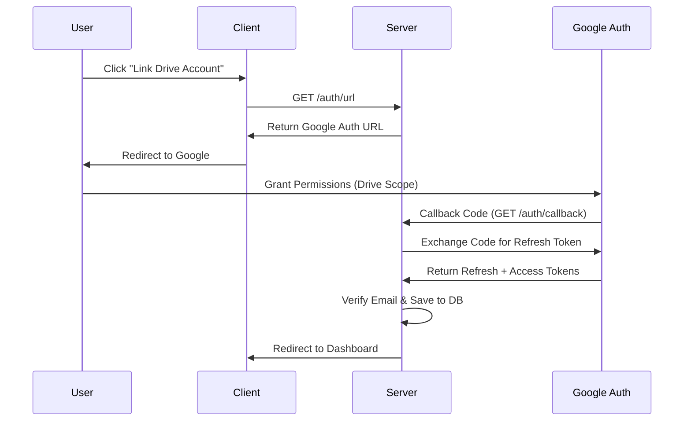
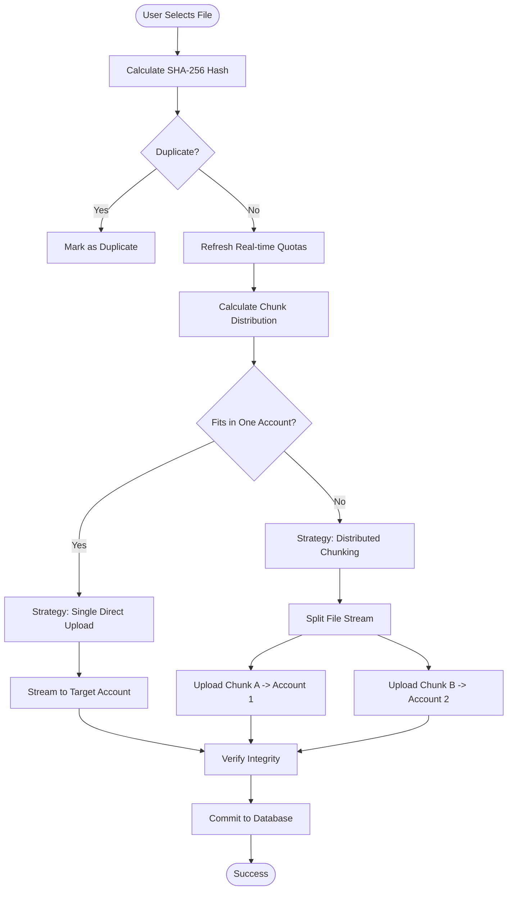
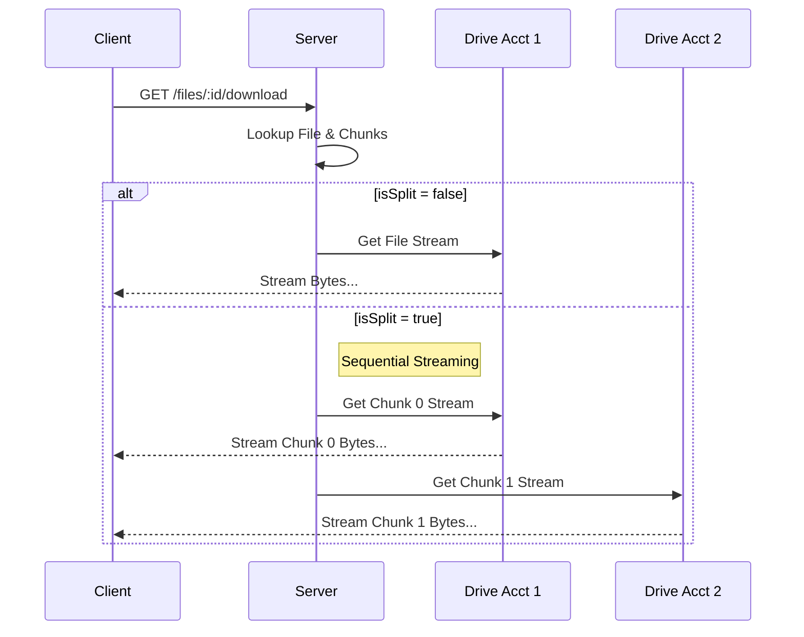

# Drive Merge - Comprehensive System Documentation

## 1. Project Overview

**Drive Merge** is a distributed file storage aggregator. It solves the problem of fragmented cloud storage by virtually pooling multiple Google Drive accounts into a single, unified file system.

### Core Value Proposition
-   **Virtual Storage Pool**: Combines free tiers of multiple Google accounts (e.g., 15GB + 15GB = 30GB).
-   **Intelligent "Sharding"**: Large files are automatically split (chunked) and distributed across accounts based on real-time available space.
-   **Transparency**: Users see one file, but the backend manages the complexity of storage locations.

---

## 2. Architecture & Tech Stack

### High-Level Architecture
The system functions as a middleware between the user and Google's servers.



### Technology Stack
| Layer | Tech | Purpose |
| :--- | :--- | :--- |
| **Frontend** | React, Vite, TS | UI/UX, Upload Dashboard, File Browser |
| **Styling** | Tailwind, Shadcn/UI | Modern, responsive aesthetics |
| **Backend** | Express.js, Node.js | Business logic, API endpoints, Stream handling |
| **Database** | Prisma + MySQL | relational data modeling, tracking file chunks |
| **Auth** | Google OAuth2 | Secure access to user's Drive accounts |
| **Storage** | Google Drive API v3 | Actual physical storage of bytes |

---

## 3. Database Schema (ER Diagram)

The backbone of Drive Merge is its ability to map a single virtual file to potentially multiple physical Drive locations.



-   **Files**: A `File` record exists for every file the user sees.
-   **Splitting**: If `isSplit` is false, the `File` points directly to a `DriveAccount`. If true, it relies on `FileChunk` records to find its data.

---

## 4. Key Workflows

### 4.1 Authentication & Account Linking
The system uses OAuth2 to act on behalf of the user. We request `offline` access to get a **Refresh Token**, which allows us to upload/download files even when the user is not actively logged in (though currently session-based).



### 4.2 The "Merge" Upload Logic (Core Engine)
This is the most complex part of the system. It decides *how* to store a file to maximize space utilization.

#### Decision Flowchart



#### Detailed Logic
1.  **Storage Analysis**: Before *every* upload, the server queries the Google Drive API for the latest `storageQuota` (limit & usage) of every connected account. DB values are updated.
2.  **Greedy Allocation**:
    -   If a user selects a "Preferred Account" and it fits, use it.
    -   Else, look for *any* single account that fits the whole file (prioritizing the one with the *least* free space that still fits it, to leave big gaps for big files? Or largest first? Current logic: Largest free space first).
    -   **Fallback (Chunking)**: If no single account fits, the system "fills up" accounts. It takes the account with the most free space, calculates a chunk size equal to that free space, assigns a chunk, and repeats with the remaining file bytes and accounts.

### 4.3 Download & Reassembly
When a user downloads a split file, the server acts as a streaming proxy.


**Result**: The client receives a single continuous byte stream, unaware that the data came from two different Google accounts.

---

## 5. Application Structure

### Backend (`/server`)
*   **`controllers/driveController.js`**:
    *   `uploadFiles`: Entry point. Parses multipart form, handles hashing, calls distribution logic.
    *   `uploadWithStorageAwareChunking`: The "Engine". Manages the concurrency (limit: 3) of chunk uploads. It uses a `Promise.race` queue to manage parallel streams.
    *   `deleteFile`: Handles localized deletion (one account) or distributed deletion (looping through chunks).
*   **`utils/googleDrive.js`**: Helper for initializing the `googleapis` library.

### Frontend (`/client`)
*   **`context/uploads.tsx`**:
    *   **Polling/SSE**: Listens for progress events. The server writes to a localized `progressMap` (in-memory) and the client polls/receives these updates to show bars like "Uploading Chunk 1/4 to user@gmail.com".
*   **`pages/Transfers.tsx`**:
    *   Displays the real-time logs.
    *   Columns: File Name, Size, Progress Bar, Speed/Status.

## 6. How to Run

### Prerequisites
1.  **Node.js** (v18+)
2.  **Google Cloud Console Project**:
    *   Enable Drive API.
    *   Create OAuth 2.0 Credentials (Client ID & Secret).
    *   Redirect URI: `http://localhost:5000/auth/callback`.

### Steps
1.  **Clone & Install**:
    ```bash
    git clone repo
    cd server && npm install
    cd ../client && npm install
    ```
2.  **Environment Setup**:
    Create `server/.env`:
    ```env
    DATABASE_URL="file:./dev.db"
    GOOGLE_CLIENT_ID="..."
    GOOGLE_CLIENT_SECRET="..."
    BACKEND_URL="http://localhost:5000"
    FRONTEND_URL="http://localhost:5173"
    ```
3.  **Run**:
    *   Server: `npm run dev` (starts on port 5000)
    *   Client: `npm run dev` (starts on port 5173)

---
