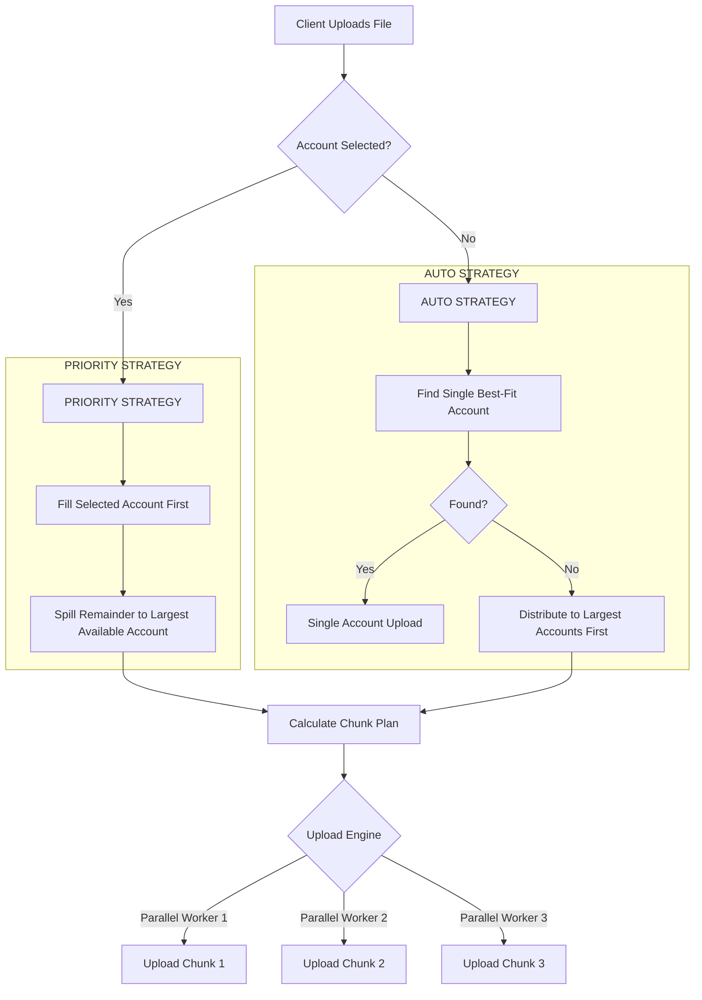

# DriveMerge: Distributed & Parallel Storage Architecture

## Overview

DriveMerge implements a **high-performance, parallelized, storage-aware file distribution system**. It aggregates storage from multiple Google Drive accounts, treats them as a unified cloud volume, and uses a concurrent upload engine to maximize throughput.

## Key Features

*   **⚡ Parallel Upload Engine**: Uploads **3 chunks simultaneously**, saturating network bandwidth and significantly reducing upload time for large files.
*   ** Strict Priority Distribution**: Respects user choice. If a specific account is selected, it fills that account *completely* before spilling over to others.
*   ** Robust Sequential Streaming**: Downloads are streamed sequentially using a memory-safe iteration loop, ensuring stability for files of any size (100GB+).

## How It Works



## detailed Architecture

### 1. Storage Analysis & Distribution
The function `calculateChunkDistribution` determines where pieces of the file go.

*   **Input**: File size, List of Accounts, `primaryAccountId` (optional).
*   **Logic**:
    1.  **Priority**: If `primaryAccountId` is set, that account is placed at the **top** of the list.
    2.  **Efficiency**: Remaining accounts are sorted by **Free Space (Descending)**. The system prefers to put the overflow into one large account rather than shattering it across many small ones.
    3.  **Chunking**: The file is sliced logically (not physically on disk) into byte ranges matching the available free space of the target accounts.

### 2. Parallel Upload Engine
The function `uploadWithStorageAwareChunking` uses a **concurrency-limited queue** to upload parts of the file.

*   **Concurrency**: **3 Chunks** at a time.
*   **Mechanism**: A `Promise.race` loop manages the active worker pool. As soon as one chunk finishes, the next one starts.
*   **Reliability**: Includes robust error handling and temporary file cleanup.

### 3. Sequential Streaming (Download)
The function `downloadFile` reassembles the file on the fly for the user.

*   **Method**: `fs.createReadStream` (from Google Drive) piped to `res`.
*   **Flow**:
    1.  Fetch Chunk 1 → Pipe to Browser → Wait for End.
    2.  Fetch Chunk 2 → Pipe to Browser → Wait for End.
    3.  ...
*   **Result**: The user sees a single, continuous download progress bar.

## API & Code Structure

### `calculateChunkDistribution`
```javascript
// Sorts accounts to prioritize the User's Choice, then the Largest Available.
const accountsWithFreeSpace = accounts.sort((a, b) => {
    // 1. Primary Account First
    if (isAPrimary(a)) return -1;
    // 2. Largest Free Space Second
    return b.freeBytes - a.freeBytes; 
});
```

### `uploadWithStorageAwareChunking` (Parallel)
```javascript
const CONCURRENCY_LIMIT = 3;
const retries = [];

for (const chunk of chunkPlan) {
    // If pool is full, wait for fastest one to finish
    while (retries.length >= CONCURRENCY_LIMIT) {
         await Promise.race(retries);
    }
    // Start new upload
    retries.push(uploadChunk(chunk));
}
```

## Logs & Debugging

You will see detailed logs indicating the decision process:

```text
You will see concise logs indicating the decision process:
 
 ```text
 📁 File: large-video.mp4
 📊 Size: 15.00 GB
 ⭐ Target Account ID: 123
 ────────────────────────────────────────────────────────────────
 📦 Calculating chunk distribution:
    📦 Chunk 0: 10.00 GB → user-selected@gmail.com
       Bytes: 0 → 10737418240
    📦 Chunk 1: 5.00 GB → backup-storage@gmail.com
       Bytes: 10737418240 → 16106127360
 ────────────────────────────────────────────────────────────────
 📤 Uploading chunk 1/2:
    • Account: user-selected@gmail.com
    • Size: 10240.00 MB
 ...
 ✅ Chunk 1/2 complete
 ```
```
